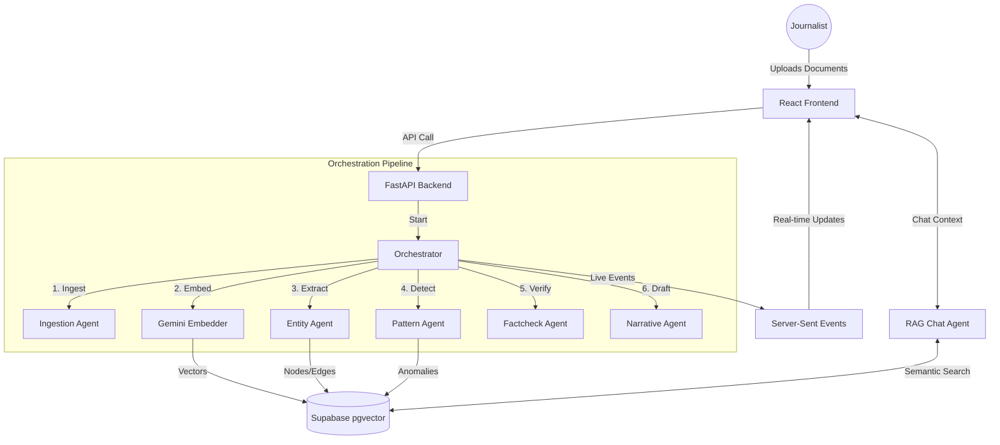

# 🛰️ Nexora

**Nexora** is an AI-powered investigative journalism platform designed to uncover hidden connections, financial patterns, and corporate networks from raw documents. Using a multi-agent orchestration pipeline, Nexora transforms leaked PDFs and memos into an interactive knowledge graph, providing journalists with automated summaries, anomaly detection, and a conversational research assistant.

---

## 🔗 Live Demo & Links
- **Deployed URL**: [https://nexora-ai-theta-snowy.vercel.app/](https://nexora-ai-theta-snowy.vercel.app/)
- **Demo Video**: [Watch Demo](https://youtu.be/your-demo-link-here) *(Optional)*
- **Documentation**: 
  - [Backend Docs](backend/README.md)
  - [Frontend Docs](frontend/README.md)
  - [Agent Pipeline Architecture](backend/agents/README.md)
  - [Setup Guide](backend/SETUP_GUIDE.md)

---

## 🌟 Key Features

- **Live Multi-Agent Pipeline**: Watch AI agents process documents in real-time (Ingestion → Embedding → Extraction → Pattern Analysis → Fact-checking).
- **Interactive Knowledge Graph**: Explore entities (People, Organizations, Locations) and their relationships with dynamic scaling and physics.
- **Agentic Chat**: Query your investigation using a streaming chat interface that understands the context of your graph.
- **Automated Narrative Generation**: Generate investigative drafts and summary reports automatically from discovered findings.
- **Real-time Telemetry**: A live "terminal" side-panel showing agent logs as they work.

---

## 🛠️ Technology Stack

- **Frontend**: React, Zustand (State Management), Force-Graph-2D (Visualization), Tailwind CSS.
- **Backend**: FastAPI (Python), LangChain (Agent Orchestration), Pydantic.
- **LLMs**: Groq (Llama 3.3 70B for extraction/reasoning), Google Gemini (Embeddings).
- **Database**: Supabase (PostgreSQL + Vector Store).
- **Deployment**: Render (Backend), Vercel (Frontend).

---

## 🏗️ System Architecture

---

## 🚀 Quick Start

### 1. Prerequisites
- Python 3.11+
- Node.js 18+
- Supabase account
- Groq API Key
- Google AI API Key (for Gemini Embeddings)

### 2. Setup Guide
For detailed instructions on setting up your local environment, database schema, and environment variables, please refer to the **[Backend Setup Guide](backend/SETUP_GUIDE.md)**.

---

## 📜 License
MIT License - Developed for the HiDevs Hackathon.
